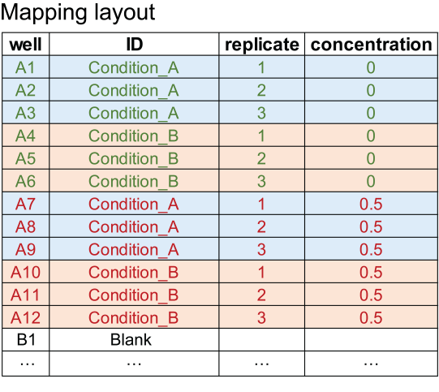

# Parse raw plate reader data and convert it to a format compatible with QurvE

`parse_data` takes a raw export file from a plate reader experiment (or
similar device), extracts relevant information and parses it into the
format required to run
[`growth.workflow`](https://nicwir.github.io/QurvE/reference/growth.workflow.md).
If more than one read type is found the user is prompted to assign the
correct reads to `growth` or `fluorescence`.

## Usage

``` r
parse_data(
  data.file = NULL,
  map.file = NULL,
  software = c("Gen5", "Gen6", "Biolector", "Chi.Bio", "GrowthProfiler", "Tecan",
    "VictorNivo", "VictorX3"),
  convert.time = NULL,
  sheet.data = 1,
  sheet.map = 1,
  csvsep.data = ";",
  dec.data = ".",
  csvsep.map = ";",
  dec.map = ".",
  subtract.blank = TRUE,
  calib.growth = NULL,
  calib.fl = NULL,
  calib.fl2 = NULL,
  fl.normtype = c("growth", "fl2")
)
```

## Arguments

- data.file:

  (Character) A table file with extension '.xlsx', '.xls', '.csv',
  '.tsv', or '.txt' containing raw plate reader (or similar device)
  data.

- map.file:

  (Character) A table file in column format with extension '.xlsx',
  '.xls', '.csv', '.tsv', or '.txt' with 'well', 'ID', 'replicate', and
  'concentration' in the first row. Used to assign sample information to
  wells in a plate.

- software:

  (Character) The name of the software/device used to export the plate
  reader data.

- convert.time:

  (`NULL` or string) Convert time values with a formula provided in the
  form `'y = function(x)'`. For example: `convert.time = 'y = 24 * x'`

- sheet.data, sheet.map:

  (Numeric or Character) Number or name of the sheets in XLS or XLSX
  files containing experimental data or mapping information,
  respectively (*optional*).

- csvsep.data, csvsep.map:

  (Character) separator used in CSV data files (ignored for other file
  types). Default: `";"`

- dec.data, dec.map:

  (Character) decimal separator used in CSV, TSV or TXT files with
  measurements and mapping information, respectively.

- subtract.blank:

  (Logical) Shall blank values be subtracted from values within the same
  experiment ([TRUE](https://rdrr.io/r/base/logical.html), the default)
  or not ([FALSE](https://rdrr.io/r/base/logical.html)).

- calib.growth, calib.fl, calib.fl2:

  (Character or `NULL`) Provide an equation in the form 'y =
  function(x)' (for example: 'y = x^2 \* 0.3 - 0.5') to convert growth
  and fluorescence values. This can be used to, e.g., convert plate
  reader absorbance values into OD₆₀₀ or fluorescence intensity into
  molecule concentrations. Caution!: When utilizing calibration,
  carefully consider whether or not blanks were subtracted to determine
  the calibration before selecting the input `subtract.blank = TRUE`.

- fl.normtype:

  (Character string) Normalize fluorescence values by either diving by
  `'growth'` or by fluorescence2 values (`'fl2'`).

## Value

A `grodata` object suitable to run
[`growth.workflow`](https://nicwir.github.io/QurvE/reference/growth.workflow.md).
See [`read_data`](https://nicwir.github.io/QurvE/reference/read_data.md)
for its structure.

## Details

Metadata provided as `map.file` needs to have the following layout:


## Examples

``` r
if(interactive()){
grodata <- parse_data(data.file = system.file("fluorescence_test_Gen5.xlsx", package = "QurvE"),
                      sheet.data = 1,
                      map.file = system.file("fluorescence_test_Gen5.xlsx", package = "QurvE"),
                      sheet.map = "mapping",
                      software = "Gen5",
                      convert.time = "y = x * 24", # convert days to hours
                      calib.growth = "y = x * 3.058") # convert absorbance to OD values
}
```
