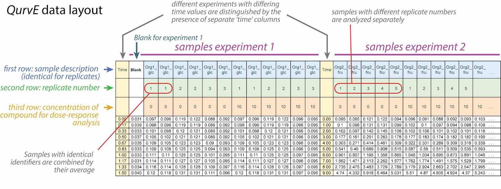

# Read growth and fluorescence data in table format

`read_data` reads table files or R dataframe objects containing growth
and fluorescence data and extracts datasets, sample and group
information, performs blank correction, applies data transformation
(calibration), and combines technical replicates.

## Usage

``` r
read_data(
  data.growth = NA,
  data.fl = NA,
  data.fl2 = NA,
  data.format = "col",
  csvsep = ";",
  dec = ".",
  csvsep.fl = ";",
  dec.fl = ".",
  csvsep.fl2 = ";",
  dec.fl2 = ".",
  sheet.growth = 1,
  sheet.fl = 1,
  sheet.fl2 = 1,
  fl.normtype = c("growth", "fl2"),
  subtract.blank = TRUE,
  convert.time = NULL,
  calib.growth = NULL,
  calib.fl = NULL,
  calib.fl2 = NULL
)
```

## Arguments

- data.growth:

  An R dataframe object or a table file with extension '.xlsx', '.xls',
  '.csv', '.tsv', or '.txt' containing growth data. The data must be
  either in the '`QurvE` custom layout' or in 'tidy' (long) format. The
  first three table rows in the 'custom `QurvE` layout' contain:

  1.  Sample description

  2.  Replicate number (*optional*: followed by a letter to indicate
      technical replicates)

  3.  Concentration value (*optional*)

  Data in 'tidy' format requires the following column headers:

  1.  "Time": time values

  2.  "Description": sample description

  3.  "Replicate": replicate number (*optional*)

  4.  "Concentration": concentration value (*optional*)

  5.  "Values": growth values (e.g., optical density)

- data.fl:

  (optional) An R dataframe object or a table file with extension
  '.xlsx', '.xls', '.csv', '.tsv', or '.txt' containing fluorescence
  data. Table layout must mimic that of `data.growth`.

- data.fl2:

  (optional) An R dataframe object or a table file with extension
  '.xlsx', '.xls', '.csv', '.tsv', or '.txt' containing measurements
  from a second fluorescence channel (used only to normalize
  `fluorescence` data). Table layout must mimic that of `data.growth`.

- data.format:

  (Character) "col" for samples in columns, or "row" for samples in
  rows. Default: `"col"`

- csvsep:

  (Character) separator used in CSV file storing growth data (ignored
  for other file types). Default: `";"`

- dec:

  (Character) decimal separator used in CSV, TSV or TXT file storing
  growth data. Default: `"."`

- csvsep.fl, csvsep.fl2:

  (Character) separator used in CSV file storing fluorescence data
  (ignored for other file types). Default: `";"`

- dec.fl, dec.fl2:

  (Character) decimal separator used in CSV, TSV or TXT file storing
  fluorescence data. Default: `"."`

- sheet.growth, sheet.fl, sheet.fl2:

  (Numeric or Character) Number or name of the sheet with the respective
  data type in XLS or XLSX files (*optional*).

- fl.normtype:

  (Character string) Normalize fluorescence values by either diving by
  `'growth'` or by fluorescence2 values (`'fl2'`).

- subtract.blank:

  (Logical) Shall blank values be subtracted from values within the same
  experiment ([TRUE](https://rdrr.io/r/base/logical.html), the default)
  or not ([FALSE](https://rdrr.io/r/base/logical.html)).

- convert.time:

  (`NULL` or string) Convert time values with a formula provided in the
  form `'y = function(x)'`. For example: `convert.time = 'y = 24 * x'`

- calib.growth, calib.fl, calib.fl2:

  (Character or `NULL`) Provide an equation in the form 'y =
  function(x)' (for example: 'y = x^2 \* 0.3 - 0.5') to convert growth
  and fluorescence values. This can be used to, e.g., convert plate
  reader absorbance values into OD₆₀₀ or fluorescence intensity into
  molecule concentrations. Caution!: When utilizing calibration,
  carefully consider whether or not blanks were subtracted to determine
  the calibration before selecting the input `subtract.blank = TRUE`.

## Value

An R list object of class `grodata` containing a `time` matrix,
dataframes with growth and fluorescence data (if applicable), and an
experimental design table. The `grodata` object can be directly used to
run
[`growth.workflow`](https://nicwir.github.io/QurvE/reference/growth.workflow.md)/[`fl.workflow`](https://nicwir.github.io/QurvE/reference/fl.workflow.md)
or, together with a `growth.control`/`fl.control` object, in
[`growth.gcFit`](https://nicwir.github.io/QurvE/reference/growth.gcFit.md)/[`flFit`](https://nicwir.github.io/QurvE/reference/flFit.md).

- time:

  Matrix with raw time values extracted from `data.growth`.

- growth:

  Dataframe with raw growth values and sample identifiers extracted from
  `data.growth`.

- fluorescence:

  Dataframe with raw fluorescence values and sample identifiers
  extracted from `data.fl`. `NA`, if no fluorescence data is provided.

- norm.fluorescence:

  fluorescence data divided by growth values. `NA`, if no fluorescence
  data is provided.

- expdesign:

  Experimental design table created from the first three identifier
  rows/columns (see argument `data.format`) (`data.growth`.

## Details



## Examples

``` r
# Load CSV file containing only growth data
data_growth <- read_data(data.growth = system.file("2-FMA_toxicity.csv",
                         package = "QurvE"), csvsep = ";" )
#> Sample data are stored in columns. If they are stored in row format, please run read_data() with data.format = 'row'.

# Load XLS file containing both growth and fluorescence data
data_growth_fl <- read_data(
                    data.growth = system.file("lac_promoters_growth.txt", package = "QurvE"),
                    data.fl = system.file("lac_promoters_fluorescence.txt", package = "QurvE"),
                    csvsep = "\t",
                    csvsep.fl = "\t")
#> Sample data are stored in columns. If they are stored in row format, please run read_data() with data.format = 'row'.
```
